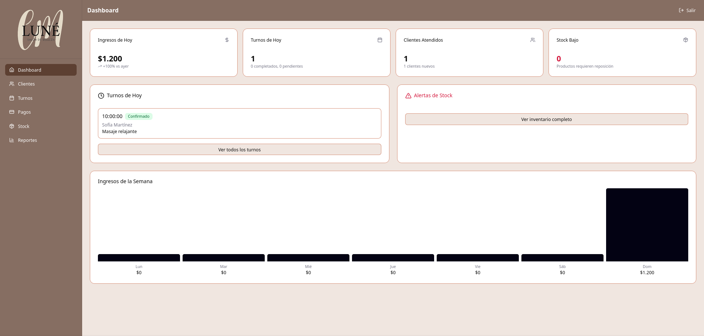
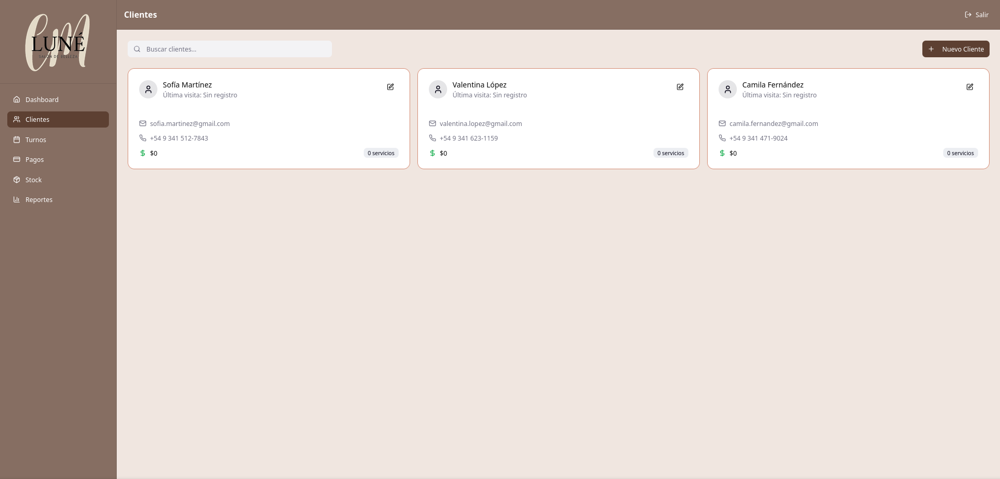
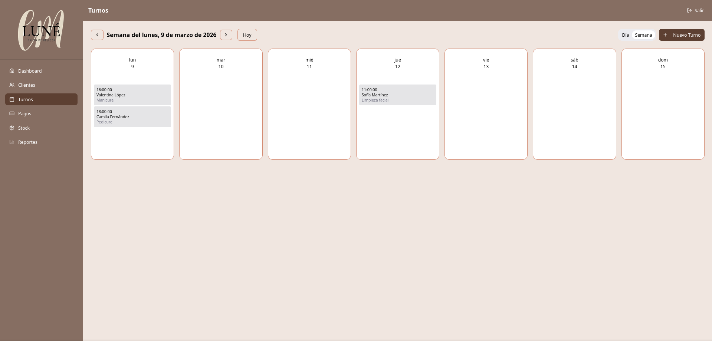
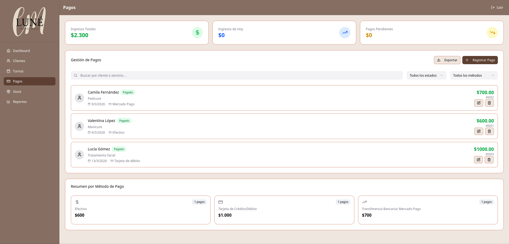
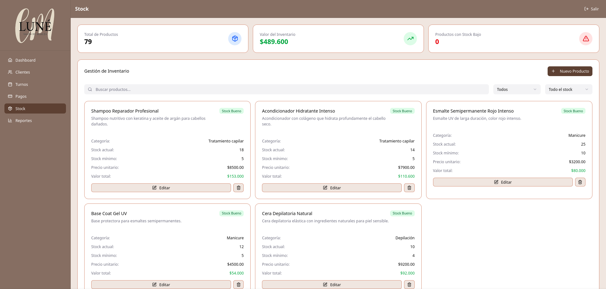
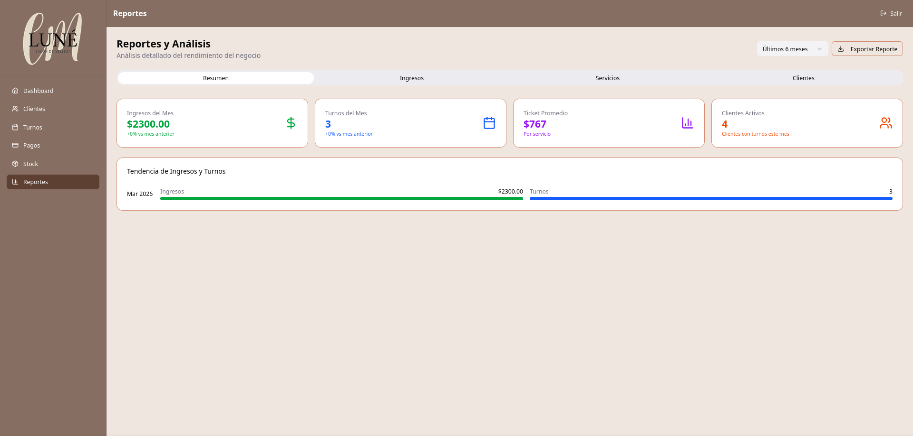

<h1 align="center">
💅 Sistema de Gestión para Centro de Estética
</h1>

<p align="center">
Aplicación web full-stack para administrar clientes, turnos, servicios, pagos y control de stock.
</p>

<p align="center">
💻 Proyecto Full-Stack · ⚛️ React · 🟢 Node.js · 🐘 PostgreSQL
</p>

<p align="center">
  
  
  
  
  
  
</p>




## 📝 Descripción

Aplicación web full-stack para la administración de un centro de estética.  
Permite gestionar clientes, turnos, servicios, pagos y control de stock de productos.

El objetivo del proyecto es ofrecer una herramienta simple para organizar la agenda del negocio y registrar las operaciones diarias.

---

## ✨ Funcionalidades

- Gestión de clientes
- Registro y administración de turnos
- Gestión de servicios
- Registro de pagos
- Control de stock de productos
- Administración de proveedores
- Alertas de stock mínimo
- Interfaz web intuitiva

---

## 🛠️ Tecnologías utilizadas

### 🎨 Frontend

<p>
  
  
  
</p>

### 🧠 Backend

<p>
  
  
</p>

### 🗄️ Base de datos

<p>
  
</p>

### 🔧 Otras herramientas

<p>
  
  
  
  
</p>

---

## 🏗️ Arquitectura del proyecto

El proyecto está dividido en dos partes principales:

- **/frontend** → aplicación web desarrollada con React
- **/backend** → API REST y conexión a base de datos PostgreSQL

---

### 🖥️ Frontend

Estructura simplificada:
```
frontend
├─ public
│ ├─ favicon.png
├─ src
│ ├─ components
│ ├─ pages
│ ├─ services
│ ├─ assets
│ └─ App.jsx
├─ index.html
└─ package.json
```
El frontend se encarga de:

- interfaz de usuario
- gestión del estado
- consumo de la API REST
- visualización de datos

---

### ⚙️ Backend

Estructura simplificada:
```
backend
├─ src
│ ├─ controllers
│ ├─ routes
│ ├─ database
│ │ ├─ db.js
│ │ └─ initDB.js
│ └─ index.js
└─ package.json
```

El backend expone una API REST para manejar:

- clientes
- turnos
- servicios
- pagos
- productos
- proveedores

---
## 📦 Instalación

### 1. Clonar el repositorio
```git clone https://github.com/A6u5/sistema-gestion-estetica.git```

---

### 2. Backend
- ```cd backend```
- ```npm install```

Crear archivo `.env`:
- `PGUSER=postgres`
- `PGPASSWORD=tu_password`
- `PGHOST=localhost`
- `PGPORT=5432`
- `PGDATABASE=estetica`

Ejecutar el servidor:
- `node src/index.js`

---

### 3. Frontend
- `cd frontend`
- `npm install`
- `npm run dev`

La aplicación estará disponible en:
- `http://localhost:5173`

---

## 📸 Capturas de pantalla

### 📊 Dashboard

---

### 👩‍💼 Gestión de clientes

---

### 📅 Turnos

---

### 💳 Pagos

---

### 📦 Control de stock

---

### 📈 Resumen


## 🚀 Posibles mejoras futuras

- Autenticación de usuarios
- Panel de estadísticas
- Recordatorios automáticos de turnos
- Sistema de roles (administrador / empleado)
- Deploy en la nube

---

## 👨‍💻 Autores

Desarrollado por Agustín Torres, Selene Mailén Ojeda y Melani Mauri.

Proyecto realizado como práctica de desarrollo full-stack utilizando React, Node.js y PostgreSQL.

---

## 📄 Licencia

Este proyecto está bajo la licencia MIT.

Puedes consultar el archivo LICENSE para más información.
